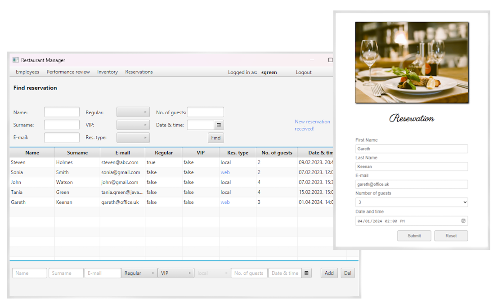

## Restaurant management app

This is a management type application developed for a Java programming class project. It consists of two integrated components: a desktop app built with JavaFX and using MVC design pattern and a web app based on Spring Boot and Hibernate. 

The desktop app is used for standard management operations. The web app simulates the process of customers submitting reservations, which are then stored in a database and retrieved by a dedicated thread within the desktop app. Both applications use a shared H2 database in server mode. 

**Features**
- management of employees, performance, inventory and reservations
- build automation and dependency management with Maven
- authentication with password hashing
- CRUD operations on all entities with filtering, sorting and validation
- different types of logging with Log4j (standard, database, authentication)
- generic classes and methods
- historical data with serialization
- multithreading with JavaFX threads, tasks and scheduled service
- RESTful API on the web app backend

#
**Try it out**
- build JavaFX and Spring Boot apps with Maven ("mvn clean package")
- create database from script (h2db-schema folder) and start H2 db server 
- run apps with "java -jar <target.jar>"
